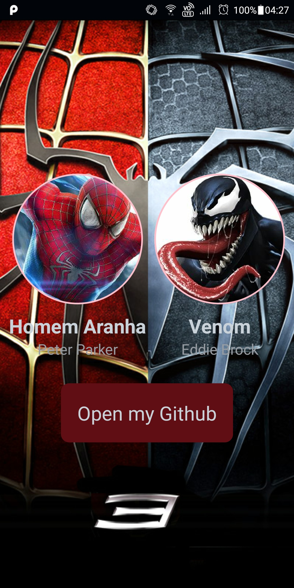

# Digital Innovation One

## Introdução ao React-Native

```html

```

## -Conteúdo

- Conhecendo o React-Native
  - O que é React-Native?
  - O que é cross-plataform?
  - Origem do RN
- Documentação:
  - Componentes
  - API
  - Comunidade(Blog)
- Setup
  - Instalação do Chocolatey
  - Node
  - Java 11 (JDK)
  - Yarn
  - Android Studio
    - Download android S
    - Criar um AVD (Android Virtual Device)
- Criação do projeto
  - Uso do React-Native CLI
  - Estrutura de pasta
- Projeto Profile
  - View
  - Text
  - SafeAreaView
  - Image
  - Flex-box
  - Style (StyleSheet)
  - Pressable
  - Linking API
  - add código nativo no AndroidManifest.xml para abrir link

